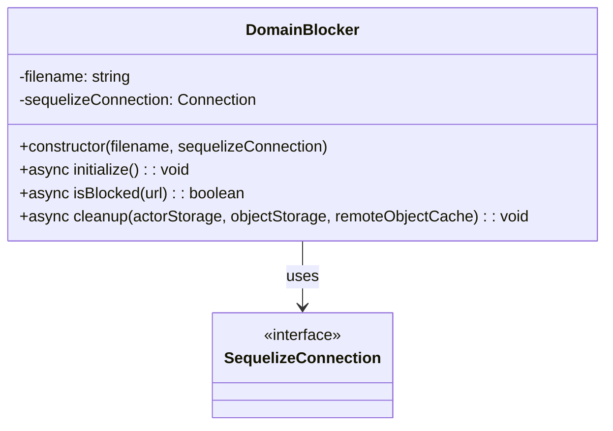
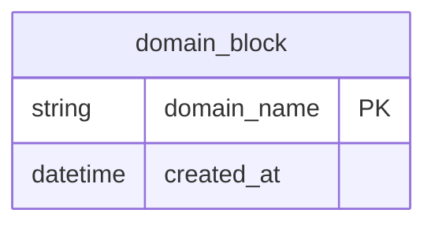

# Blocklist

OK, we're going to add blocklist files to activitypub-bot (and from there, tags.pub and groups.pub). Here are the features I want to implement:

- take a blocklist in Mastodon denylist format on the command line
- sync it to the server blocklist (add new items, remove old items)
- Authorizer.canRead() is always false for actors with ids in a domain on the blocklist
- Prevent GET requests signed by an account on a domain on the blocklist
- Prevent POST requests signed by an account on a domain on the blocklist
- Prevent Activity ingestion on bot inbox or shared inbox for actors on the domain blocklist or activity on the domain blocklist or object on the domain blocklist
- At startup, unfollow any accounts on a domain on the blocklist
- At startup, reject follows by any accounts on a domain on the blocklist
- At startup, undo announce for any announce activities with objects with ids on the blocklist
- Do not distribute activities to inboxes on domains on the blocklist

## Classes

## ERD

